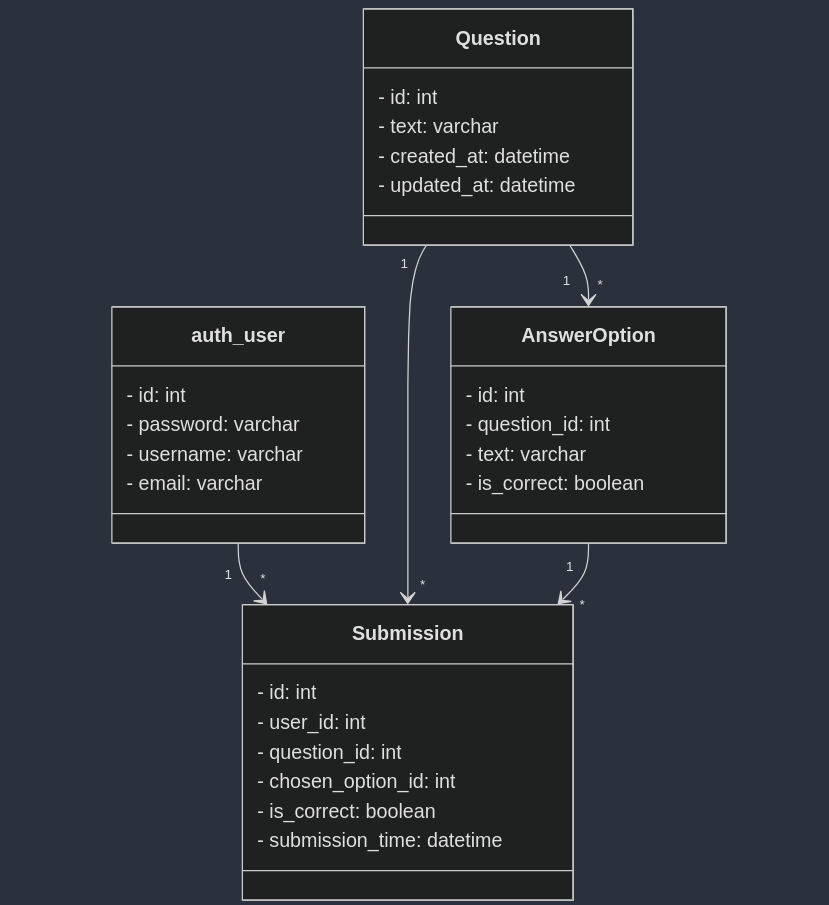

# QuizBit

## API documentation 
[postman documentation](https://documenter.getpostman.com/view/27408193/2sAYBRGu7v)

## Database Design
Here, ER Diagram of the Database that I used here, 
```
erDiagram
    auth_user {
        int id PK
        varchar password
        datetime last_login
        boolean is_superuser
        varchar username
        varchar first_name
        varchar last_name
        varchar email
        boolean is_staff
        boolean is_active
        datetime date_joined
    }

    Question {
        int id PK
        varchar text
        datetime created_at
        datetime updated_at
    }

    AnswerOption {
        int id PK
        int question_id FK
        varchar text
        boolean is_correct
    }

    Submission {
        int id PK
        int user_id FK
        int question_id FK
        int chosen_option_id FK
        boolean is_correct
        datetime submission_time
    }

    auth_user "1" -- "*" Submission : user
    Question "1" -- "*" AnswerOption : question
    Question "1" -- "*" Submission : question
    AnswerOption "1" -- "*" Submission : answer_option
```



