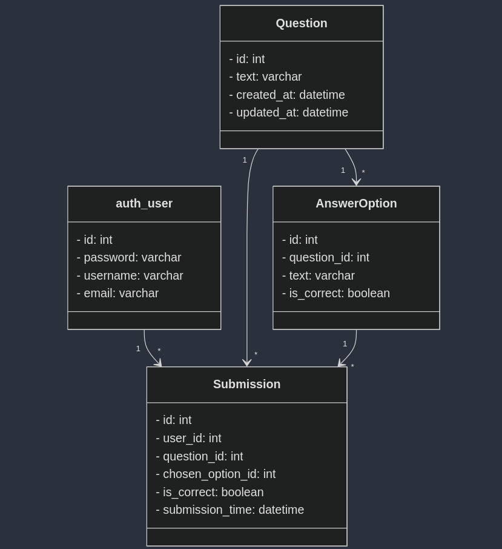

# QuizBit

## Installation Guide
1. Clone the repository
```
git clone https://github.com/MNnazrul/QuizBit.git
```
2. Navigate to the QuizBit folder
```
cd QuizBit
```
3. Create virtual environment
```
python -m venv venv

```

4. activate virtual environment.

    * On Windows:
    ```
    venv\Scripts\activate
    ```
    * On macOS/Linux:
    ```
    source venv/bin/activate
    ```

5. Install the required libraries
Open a command line terminal in the cloned repository folder
```
pip install -r requirements.txt
```

6. Run database migrations
```
python manage.py migrate

```

7. Run the below command to start the project
```
python manage.py runserver
```
## API documentation 
[postman documentation](https://documenter.getpostman.com/view/27408193/2sAYBRGu7v)

## Database Design
Here, ER Diagram of the Database that I used here, 
```
erDiagram
    auth_user {
        int id PK
        varchar password
        varchar username
        varchar email
    }

    Question {
        int id PK
        varchar text
        datetime created_at
        datetime updated_at
    }

    AnswerOption {
        int id PK
        int question_id FK
        varchar text
        boolean is_correct
    }

    Submission {
        int id PK
        int user_id FK
        int question_id FK
        int chosen_option_id FK
        boolean is_correct
        datetime submission_time
    }

    auth_user "1" -- "*" Submission : user
    Question "1" -- "*" AnswerOption : question
    Question "1" -- "*" Submission : question
    AnswerOption "1" -- "*" Submission : answer_option
```



